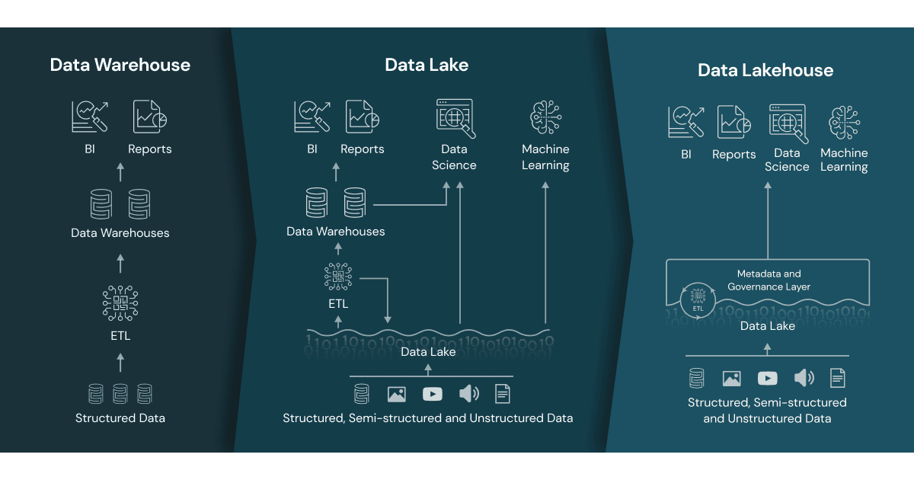
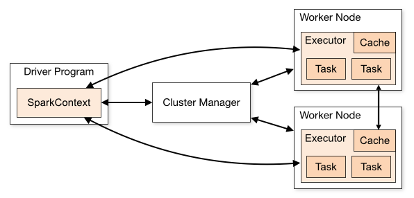
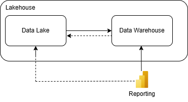

## Definitions
1. **Data Lake** - scalable storage repositories (HDFS, Cloud e.g. ADSL Gen 2) that hold
raw data. There are file based system that work on clusters
2. **Data Warehouse** - storage for structured (tabular) data. Usually scaled up to one single machine. The lack of ACID. Poorly suited of BI queries, slow in perfomance.
3. **Lakehouse** - or data lakehouse - Combines best from Data Lake and Data Warehouse
4. **Delta lake** - storage layer for lakehouse based on open standard Delta Lake (parquet data files  with file-based transatcion log for ACID transactions)
5. **Databricks** - Unified platform built on Lakehouse Architecture with default format: Delta [Delta official](https://delta.io/ "Delta format official docs")




??? info "ACID"
    **Atomicity** (all transactions complete with success of complete failure). **Consistency** (state of the data is the same for simultaneous operations). 
    **Isolation** (how simultaneous operations potentially confflic with one another - optimistic concurenncy control). **Durability** (commitet changes are permanent). 

    Thanks to: write serializable isolation and optimistic concurenncy control


## Parallel computing
Heavy workloads and growing business needs requires another aproach to computing. One mainframe computers are expensive
and diffcult to upgrade. Below example of Apache spark architecture.



Partitioning (Huge table - partition - files). Subdividing data by column. Do not use partition for high 
data cardinality use. load_date, country. Problem malych plikow. Avoid column with high skewness or null values.

|id | lane_no | vehicle_count | sys_load_date |
|:--|:--|:--|:--------------|
|1|1|12| 2025-03-24    |

``` py title="partitionBy"
``` py title="partitionBy"
df.write.format("delta").partitionBy("sys_load_date").saveAsTable("traffic_monitoring")
```

## Use Cases
1. Reporting (Power BI)




2. Real time management (bike sharing stations with ticketing system)


https://community.databricks.com/t5/technical-blog/real-time-vehicle-fleet-analytics-with-databricks-delta-live/ba-p/91422?lightbox-message-images-91422=11415i9EEB3BC3960C04C9

3. Combine multiple data

4. Data sharing 
   - internal
   - external


