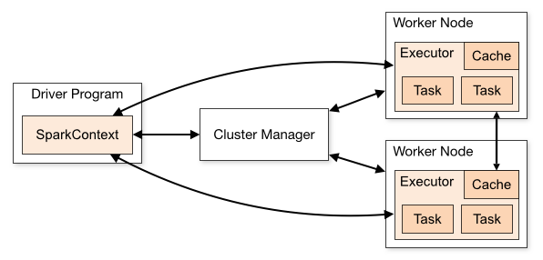

## Apache spark engine

Obliczenia na dużych zbiorach danych wymagają innego, równoległego podejścia do przetwarzania.  Powszechnie
stosowanym systemem przetwarzania równoległego jest Apache Spark. Architektura spark opiera się
na modelu master-slave. Główny węzeł (driver) zarządza zadaniami i koordynuje pracę węzłów roboczych (workers).
Każdy węzeł roboczy składa się z wielu wykonawców (executors), które wykonują zadania równolegle.



Partycjonowanie danych - jednym z najisottniejszych zagadnień w przetwarzaniu rozproszonym jest zminimalizownaie
liczby przyczytanych danych (dane są fizycznie składowanie w plikach). Jednym z najwcześniejszych sposobów na
optymalizację zapytań jest partycjonowanie danych. Partycjonowanie to podział dużej tabeli na mniejsze, bardziej
zarządzalne części, zwane partycjami. Partycje są tworzone na podstawie wartości w jednej lub więcej kolumn
tabeli. Dzięki temu, gdy zapytanie jest wykonywane, tylko odpowiednie partycje są odczytywane, co znacznie zmniejsza ilość
przetwarzanych danych i poprawia wydajność zapytań.

Dzisiejsze platformy przetwarzania bazujące na standardzie DELTA automatycznie zarządzają partycjonowaniem danych, czego
przykładem jest np. Liquid Clustering. Zapewnia on opytamalną wielkość plików i zarządzanie nimi.


|id | lane_no | vehicle_count | sys_load_date |
|:--|:--|:--|:--------------|
|1|1|12| 2025-03-24    |

``` py title="partitionBy"
df.write.format("delta").partitionBy("sys_load_date").saveAsTable("traffic_monitoring")
```