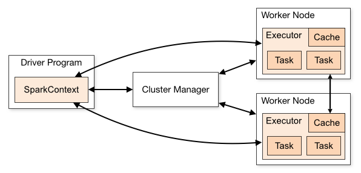
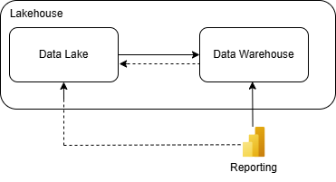

## Databricks

Unified analytics platform built on Lakehouse Architecture with default format: Delta [Delta official](https://delta.io/ "Delta format official docs")


## Storage 
Structured and semi-structured data. Delta format


## Compute
Spark engine

Heavy workloads and growing business needs requires another aproach to computing. One mainframe computers are expensive
and diffcult to upgrade. Below example of Apache spark architecture.



Partitioning (Huge table - partition - files). Subdividing data by column. Do not use partition for high 
data cardinality use. load_date, country. Problem malych plikow. Avoid column with high skewness or null values.


|id | lane_no | vehicle_count | sys_load_date |
|:--|:--|:--|:--------------|
|1|1|12| 2025-03-24    |

``` py title="partitionBy"
df.write.format("delta").partitionBy("sys_load_date").saveAsTable("traffic_monitoring")
```


??? info "ACID"
    **Atomicity** (all transactions complete with success of complete failure). **Consistency** (state of the data is the same for simultaneous operations). 
    **Isolation** (how simultaneous operations potentially confflic with one another - optimistic concurenncy control). **Durability** (commitet changes are permanent). 

    Thanks to: write serializable isolation and optimistic concurenncy control


## Parallel computing


## Use Cases
1. Reporting (Power BI)




2. Real time management (bike sharing stations with ticketing system)


https://community.databricks.com/t5/technical-blog/real-time-vehicle-fleet-analytics-with-databricks-delta-live/ba-p/91422?lightbox-message-images-91422=11415i9EEB3BC3960C04C9

3. Combine multiple data

4. Data sharing 
   - internal
   - external


