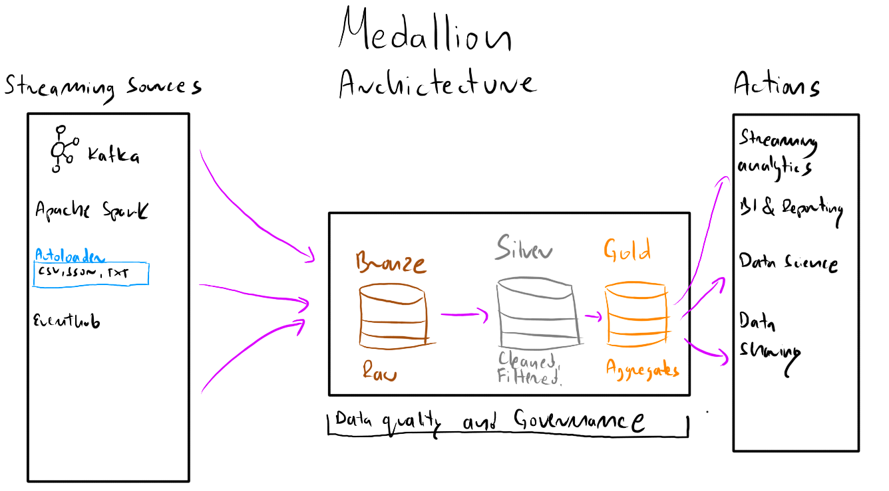

## **Definicje**
1. **Data Lake** - skalowalna przestrzeń która przechowauje dane surowe. Data lake bazuje na systemach plików i umieszczana jest na klastrach (HDFS, Cloud e.g. ADSL Gen 2)
2. **Data Warehouse** - przestrzeń do składowania danych ustrukturyzowanych (tabularycznych). Zwykle umieszczona na jednej maszynie, a co za tym idzie mało skalowalna.
3. **Lakehouse** - or data lakehouse - Oferuje najlepsze cechy Data Lake i Data Warehouse.
4. **Delta lake** - storage layer for lakehouse based on open standard Delta Lake (parquet data files  with file-based transatcion log for ACID transactions)
5. **Databricks** - Unified platform built on Lakehouse Architecture with default format: Delta [Delta official](https://delta.io/ "Delta format official docs")

## **Architektura Medalionu**
To wzorzec projektu służący do organizowania danych w Lakehouse. Składa się z trzech warstw:
Bronze => Silver => Gold

| Bronze                                                                    | Silver                                 | Gold                                                                                        |
|:--------------------------------------------------------------------------|:---------------------------------------|:--------------------------------------------------------------------------------------------|
| Raw data, where data comes from external systems.                         | Cleansed and preprocessed data         | "Project - specific" (Product). Usually for reporting purposes (fact and dimensions tables) |
| Managed by Data Engineers and Administrators with no access to other uses | Source data for self-service analytics |                                                                                             |

 Table 1: Opis tabel w architekturze medalionu

Data Lake (storage, external storage + warehouse (plus sql endpoint))

## **Przykłady wykorzystania Lakehouse**
1. **Raportowanie dzienne**

2. **Zarządzanie w czasie rzeczywistym** (bike sharing stations with ticketing system)

https://community.databricks.com/t5/technical-blog/real-time-vehicle-fleet-analytics-with-databricks-delta-live/ba-p/91422?lightbox-message-images-91422=11415i9EEB3BC3960C04C9

3. **Demokratyzacja danych**
Demokratyzacja danych to proces umożliwiający dostęp do danych wszystkim pracownikom organizacji, 
niezależnie od ich umiejętności technicznych. W Lakehouse, dane są przechowywane w formacie Delta, co ułatwia ich udostępnianie i analizę.

5. **Udostępnienie danych**
   - Delta sharing
   - Clean rooms

