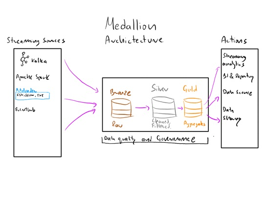
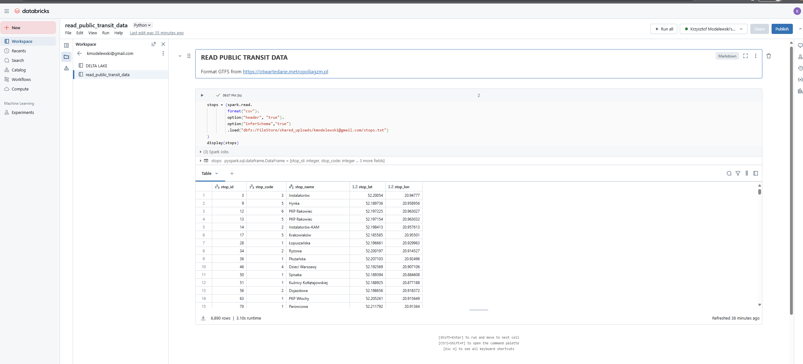
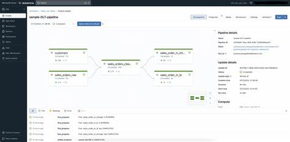

# Analityka danych w transporcie

Kurs adresowany jest do osób które chcą ropozpocząć lub zwiększyć swoje umiejętności w analizie
danych. Na kursie omówimy przykłady z dziedziny transportu i smart city, a pozyskane umiejętności będą służyły w 
każdej innej dziedzinie. 

W trakcie zajęć poznamy nowoczesne, chmurowe środowisko analityczne [Databricks](https://www.databricks.com) pozwalające na analizę i 
wizualizację danych z dowolnych plików, baz danych, żródeł czasu rzeczywistego (streamin danych) oraz usług opartych o REST API. 

## Przegląd kursu

 
Omówienie architektury Medalionu i nowoczesnej analizy w  <strong>Delta Lake </strong> oraz sposobów jej wykorzytania
w bieżącym powiadamianiu, monitorowaniu i raportowaniu.
Wprowadzenie do architektury <strong>Lakehouse i Delta Lake</strong>. Analiza danych z plików, baz danych i API.

 

 

 

<!--rysunek-->

 

 

 
Praca w interkatywnym środowisku notatników. Krok po kroku zapoznanie ze środowiskiem Databricks oraz poznanie
standardu DELTA LAKE

 

 
Analizy na danych z istniejących systemów/aplikacji. W tym z systemu detekcji wideo i ruchu pojazdów transportu publicznego.

 

 

 

 

 

 
 Tworzenie przepływów (workflows) i zadań (jobs) oraz ich harmonogramowanie. Efektem końcowym będą raporty 
zbudowane bezpośrednio na platformie Databricks

 

## 🔐 Dostęp do materiałów

Uczestnicy kursu otrzymają dostęp do materiałów na początku zajęć.

© 2025 Krzysztof Modelewski
